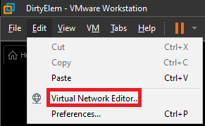
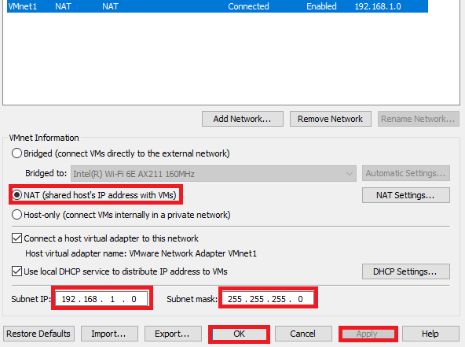
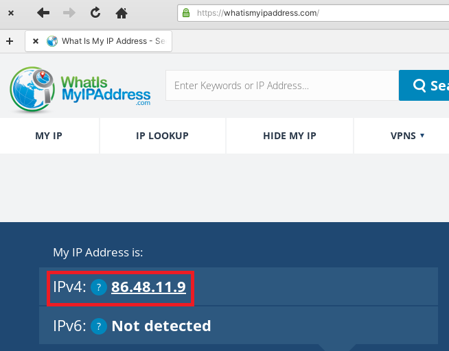

# Configuring NordVPN to VM

<details>

<summary>On Windows Machine (With NordVPN)</summary>

* Open elevated cmd.exe, run following commands:
  * IP Forwarding on Windows Host
    *   ```
        netsh interface ipv4 set interface "NordLynx" forwarding=enabled
        ```


  * Add routing rule on Windows Host to forward traffic from VM's NAT network thru VPN interface
    * ```
      route add [NAT_SUBNET] mask [SUBNET_MASK] [VPN_INTERFACE_IP]
      route add 192.168.1.0 mask 255.255.255.0 10.5.0.2
      ```

</details>

<details>

<summary>On Vmware Workstation</summary>

* Go to Edit --> Virtual Network Editor



*   Create a new NAT network -> "Add Network" -> Select NAT, put in NAT IP range (use ipconfig) if unsure -> "Apply" -> "Ok"


    <figure><figcaption></figcaption></figure>

</details>

<details>

<summary>On Linux VM</summary>

* Connect to IP -> Is VPN IP



&#x20;

</details>
